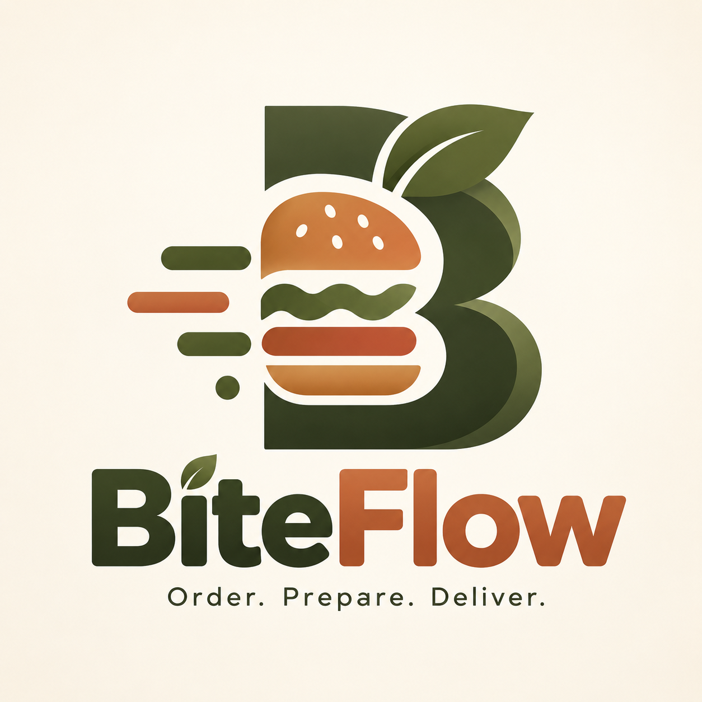
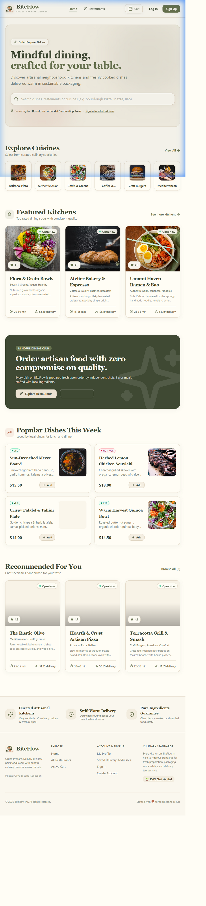
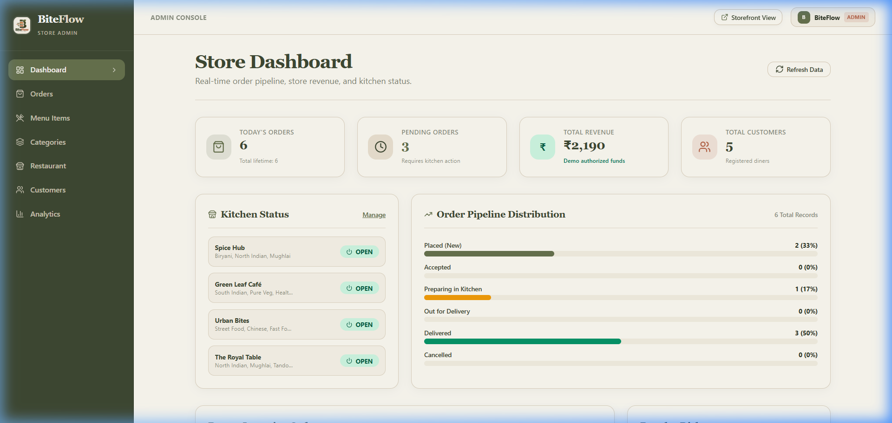
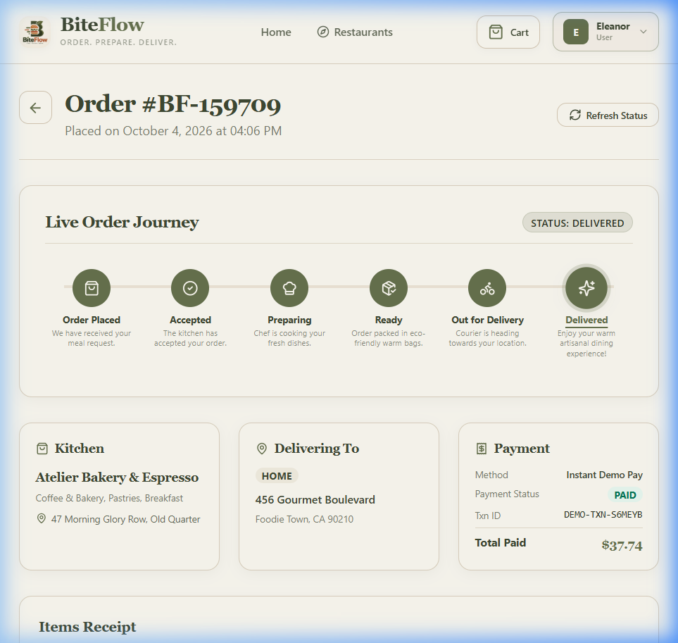
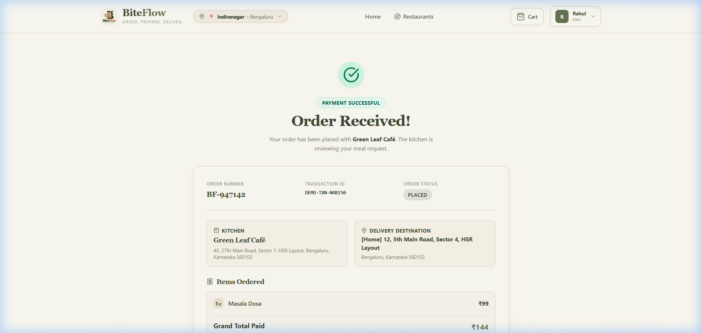
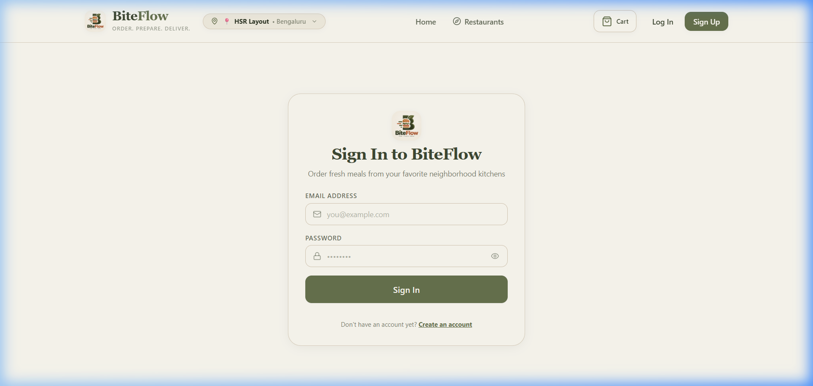
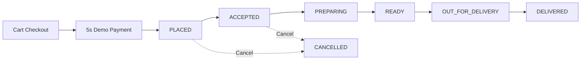

<div align="center">

  

  # BiteFlow

  ### Order. Prepare. Deliver.

  A modern full-stack food ordering platform built with React, TypeScript, Node.js, Express, and MongoDB.

  <p>
    
    
    
    
    
    
    
    
  </p>

</div>

---

## 📸 Product Preview

Real screenshots captured directly from the running BiteFlow application:

<div align="center">

### Customer Storefront (Bengaluru Kitchens & Dishes)


<br/><br/>

<table>
  <tr>
    <td width="50%" align="center">
      <b>Admin Kitchen Operations Dashboard</b><br/><br/>
      
    </td>
    <td width="50%" align="center">
      <b>Live 6-Step Visual Order Tracking</b><br/><br/>
      
    </td>
  </tr>
  <tr>
    <td width="50%" align="center">
      <b>Order Confirmation & Itemized Receipt</b><br/><br/>
      
    </td>
    <td width="50%" align="center">
      <b>Unified Sign In Portal (Eye Password Toggle)</b><br/><br/>
      
    </td>
  </tr>
</table>

</div>

---

## 📖 About BiteFlow

**BiteFlow** is a full-stack food delivery application designed to connect diners with artisanal neighborhood kitchens. Tailored specifically for the Indian dining ecosystem, BiteFlow features an earthy Olive & Sand design aesthetic, real-time status synchronization, and an interactive restaurant administration hub.

### Two Integrated Interfaces:
1. **Customer Storefront (`/`)**: Diners can browse kitchens across Bengaluru neighborhoods, filter by dietary preferences (Vegetarian, Vegan, Non-Veg), search menus, manage a persistent cart, save delivery addresses, execute a demo checkout flow, and track live order progress.
2. **Store Admin Portal (`/admin/*`)**: Kitchen managers can monitor daily KPIs, track live orders, transition tickets through kitchen stages (Accept $\rightarrow$ Cook $\rightarrow$ Ready $\rightarrow$ Dispatch $\rightarrow$ Deliver), create and manage restaurant listings, toggle operating status (Open/Closed), and manage food inventory.

> ℹ️ **Demonstration Flow**: BiteFlow currently uses a simulated 5-second payment flow for demonstration purposes. No real financial charges are made.

---

## 🚀 Core Features

### 🍽️ Customer Experience
- **Authentication**: Email/password registration and login with input validation, JWT token persistence, and interactive show/hide password toggles.
- **Restaurant Discovery**: Search restaurants by name, cuisine, dietary tags, and operating status (Open / Closed).
- **Interactive Menu**: View detailed dish cards with culinary imagery, spicy/veg tags, descriptions, and INR (₹) prices.
- **Shopping Cart**: Client-side cart state with local storage persistence, item counters, restaurant conflict checks, and automated fee breakdown.
- **Address Book**: Save multiple delivery addresses (Home, Work, Other) with street, city, state, and pincode.
- **Demo Checkout**: Bill summary (subtotal, delivery fee, platform fee) with an animated 5-second simulated payment modal.
- **Live Visual Tracking**: 6-step status timeline with live updates powered by Server-Sent Events (SSE) and polling fallback.
- **Order History & Receipts**: Itemized receipts with order numbers (`BF-XXXXXX`), unique transaction IDs, and delivery addresses.
- **User Profile**: Account details and default address management.

### 🏪 Admin & Kitchen Management
- **Role-Based Protection**: Restricted to authenticated accounts with the `ADMIN` role.
- **Operations Dashboard**: Real-time KPI summaries including Total Revenue, Pending Tickets, Today's Deliveries, and Customer count.
- **Store Profile Management**:
  - Register new kitchens (`+ Add Restaurant`) with descriptions, cuisine tags, contact details, and Bengaluru locality presets.
  - One-click store status toggle (**OPEN** vs. **CLOSED**).
  - Kitchen activation/deactivation toggling.
  - Live customer storefront preview from within the admin suite.
- **Category CRUD**: Create, edit, and toggle food category visibility.
- **Menu Management**: Create, edit, and delete food items; toggle dish stock availability (**In Stock** vs. **Sold Out**).
- **Order Ticket Pipeline**: Live incoming order feed with visual and audio alerts and one-click status transitions.
- **Customer Directory**: View customer order frequency, contact details, and lifetime platform spend.
- **Analytics**: Overview of revenue volume, average order values, and fulfillment metrics.

---

## 👥 User Roles

| Role | Target Portal | Capabilities |
| :--- | :--- | :--- |
| **`USER`** | Customer Storefront (`/`) | Browse restaurants, manage cart, save addresses, checkout with demo payment, track orders in real time, view order history. |
| **`ADMIN`** | Admin Console (`/admin/*`) | Full store creation & management, menu & category CRUD, order pipeline transitions, incoming ticket stream, customer analytics. |

---

## 🔄 Order Lifecycle

Every order transitions through defined states tracked in the database and synchronized across connected clients:



---

## 🏛️ System Architecture

```text
┌────────────────────────────────────────────────────────┐
│                   React 18 Frontend                    │
│      TypeScript • Vite • Tailwind CSS • Lucide Icons   │
└───────────────────────────┬────────────────────────────┘
                            │
              REST APIs     │   Server-Sent Events (SSE)
              (JSON / HTTP) │   (Query Token Auth)
                            ▼
┌────────────────────────────────────────────────────────┐
│                  Node.js + Express API                 │
│         JWT Authentication • Dynamic LAN CORS          │
└─────────────┬───────────────────────────┬──────────────┘
              │                           │
              ▼                           ▼
┌───────────────────────────┐ ┌───────────────────────────┐
│     MongoDB / Atlas       │ │   Nodemailer Service      │
│  Mongoose Schemas (5)     │ │   SMTP / Dev Console Bus  │
└───────────────────────────┘ └───────────────────────────┘
```

---

## 🛠️ Technology Stack

| Layer | Technology | Version | Purpose |
| :--- | :--- | :--- | :--- |
| **Frontend Framework** | React | `^18.3.1` | Component-driven declarative UI |
| **Language** | TypeScript | `^5.7.3` | Type safety across frontend and backend |
| **Build Tool** | Vite | `^6.0.7` | High-speed HMR and production bundling |
| **Routing** | React Router DOM | `^6.28.1` | Client-side routing with role-based guards |
| **Styling** | Tailwind CSS | `^3.4.17` | Utility-first styling with custom Olive & Sand theme |
| **Icons** | Lucide React | `^0.473.0` | UI iconography including password eye toggles |
| **HTTP Client** | Axios | `^1.7.9` | Promise-based API requests with Bearer interceptors |
| **Backend Runtime** | Node.js | v18+ / v20+ | Asynchronous event-driven server runtime |
| **Backend Framework** | Express | `^4.21.2` | RESTful API server and SSE streaming |
| **Database ODM** | Mongoose | `^8.9.5` | Strict schema modeling for MongoDB |
| **Authentication** | JWT (`jsonwebtoken`) | `^9.0.2` | Stateless signed authorization tokens |
| **Password Security** | bcryptjs | `^2.4.3` | One-way password hashing with salt factor 10 |
| **Email Service** | Nodemailer | `^10.0.14` | Automated transactional emails (SMTP / Dev fallback) |
| **CORS Middleware** | cors | `^2.8.5` | Dynamic origins with private LAN IP support |
| **Dev Server** | ts-node-dev | `^2.0.0` | Hot-reloading TypeScript backend runner |

---

## 🎨 Design System

BiteFlow uses a warm, culinary-inspired color palette:

| Color | Hex | Role | Usage |
| :--- | :--- | :--- | :--- |
| **Olive** | `#68734F` | Primary | Main buttons, active filters, highlights, CTAs |
| **Dark Olive** | `#3F4933` | Dark Surface | Headings, admin navigation sidebar, high-contrast text |
| **Sand** | `#EDE4D3` | Secondary | Borders, subtle card backgrounds, badge containers |
| **Cream** | `#FFFDF5` | Canvas | Main body background, elevated card surfaces |
| **Terracotta** | `#B9674B` | Accent | Badges, errors, alerts, culinary warmth |

- **Design Philosophy**: Matte finish, rounded cards (`rounded-2xl` / `rounded-3xl`), subtle shadows, and clean modern typography.
- **Accessibility & UX**: All password fields feature an inline show/hide eye toggle button (`type="button"`) with accessible `aria-label` tags that preserves input values and focus state.

---

## ⚡ Technical Highlights

### 1. Dynamic Local Network (LAN) Connectivity
When accessed from secondary devices (phones, tablets, laptops) on the same Wi-Fi network:
- Express listens on `0.0.0.0:5000` and Vite binds to `0.0.0.0:5173`.
- The frontend dynamically determines the browser's current hostname (`window.location.hostname`). A mobile device opening `http://192.168.x.x:5173` automatically dispatches API requests to `http://192.168.x.x:5000/api` with zero configuration needed.
- Backend CORS automatically permits private LAN IP ranges (`192.168.*`, `10.*`, `172.16-31.*`) during development.

### 2. Real-Time Order Updates (SSE + Smart Polling)
- Primary updates stream via Server-Sent Events (`/api/orders/:id/live` and `/api/orders/live/admin`).
- Query-token authentication enables browser `EventSource` connections.
- Smart polling (4.5s–5s interval) runs in parallel to ensure reliability even across unstable proxies or mobile sleep cycles.

### 3. Automated Transactional Emails
- Handled by Nodemailer with branded HTML templates matching the Olive & Sand palette.
- Automatically dispatches notifications across 7 order events (`PLACED`, `ACCEPTED`, `PREPARING`, `READY`, `OUT_FOR_DELIVERY`, `DELIVERED`, `CANCELLED`).
- Fallback development simulator logs formatted email previews to the server console if SMTP credentials are not configured.
- The `Order` model tracks `sentEmailStatuses` to eliminate duplicate notifications.

### 4. India Localization
- Currency formatted in Indian Rupees (**₹**) using `Intl.NumberFormat('en-IN')`.
- Localized around Bengaluru (Indiranagar, Koramangala, HSR Layout, Whitefield, Jayanagar) with realistic delivery fees (₹40) and platform charges (₹10).

---

## 📁 Project Structure

```text
BiteFlow/
├── frontend/                         # React 18 + TypeScript + Vite
│   ├── public/
│   │   ├── logo.png                  # BiteFlow Brand Logo
│   │   └── favicon.svg
│   ├── src/
│   │   ├── components/               # UI components (auth, common, food, restaurant)
│   │   ├── context/                  # AuthContext, CartContext, ToastContext
│   │   ├── hooks/                    # useAuth, useCart, useToast, useOrderRealtime, etc.
│   │   ├── layouts/                  # MainLayout (Storefront), AdminLayout (Console)
│   │   ├── pages/                    # Customer and Admin page views
│   │   ├── services/                 # api.ts (dynamic LAN resolver), auth, orders, etc.
│   │   ├── types/                    # Domain TypeScript interfaces
│   │   ├── App.tsx                   # Routing configuration
│   │   └── main.tsx                  # Application bootstrap
│   ├── .env.example
│   ├── package.json
│   ├── tailwind.config.js
│   ├── tsconfig.json
│   ├── vercel.json                   # SPA rewrite rules
│   └── vite.config.ts                # Host 0.0.0.0 server settings
│
├── backend/                          # Express + TypeScript + MongoDB
│   ├── src/
│   │   ├── config/                   # db.ts (Mongoose connection)
│   │   ├── controllers/              # Request handlers (auth, restaurant, food, etc.)
│   │   ├── middleware/               # auth.middleware, error.middleware
│   │   ├── models/                   # User, Restaurant, Category, Food, Order schemas
│   │   ├── routes/                   # REST route definitions
│   │   ├── seed/                     # Bengaluru seed dataset & execution script
│   │   ├── services/                 # Business logic & email service
│   │   ├── utils/                    # SSE event bus & response helpers
│   │   └── server.ts                 # Express app & CORS policy
│   ├── .env.example
│   ├── package.json
│   ├── tsconfig.json
│   └── vercel.json                   # Serverless deployment configuration
│
├── docs/                             # Documentation assets
│   ├── logo.png                      # High-resolution brand logo
│   └── screenshots/                  # Verified application screenshots
│       ├── home.png
│       ├── admin-dashboard.png
│       ├── order-tracking.png
│       ├── order-confirmation.png
│       └── login.png
│
├── run.bat                           # 1-Click Windows batch launcher
├── run.ps1                           # 1-Click Windows PowerShell launcher
├── CREDENTIALS.md                    # Access credentials and role matrix
└── README.md                         # Official project documentation
```

---

## 💻 Local Development

### Prerequisites
- **Node.js**: v18.0.0 or higher
- **npm**: v9.0.0 or higher
- **MongoDB**: Local MongoDB instance (`mongod`) or free [MongoDB Atlas](https://www.mongodb.com/atlas) cluster URI

### 1. Clone & Install
```bash
git clone <repository-url>
cd BiteFlow

# Install Backend dependencies
cd backend
npm install

# Install Frontend dependencies
cd ../frontend
npm install
cd ..
```

### 2. Environment Setup
Create environment files from the provided templates:

```bash
# Windows PowerShell
Copy-Item backend/.env.example backend/.env
Copy-Item frontend/.env.example frontend/.env
```

Update `backend/.env` with your `MONGODB_URI` and `JWT_SECRET`.

### 3. Database Seeding
Populate the database with authentic Bengaluru restaurants, dishes, categories, and past orders:
```bash
cd backend
npm run seed
cd ..
```

### 4. Running the Application

#### Option A: 1-Click Launchers (Windows)
Run from the root directory to open backend and frontend in separate terminals:
```cmd
run.bat
```
or via PowerShell:
```powershell
.\run.ps1
```

#### Option B: Manual Startup
```bash
# Terminal 1: Backend API (Port 5000)
cd backend
npm run dev

# Terminal 2: Frontend App (Port 5173)
cd frontend
npm run dev
```

---

## 🔐 Environment Variables

### Frontend (`frontend/.env`)
```env
# API Base URL (leave default for automatic LAN hostname discovery)
VITE_API_URL=http://localhost:5000/api
```

### Backend (`backend/.env`)
```env
# Server
PORT=5000
HOST=0.0.0.0
NODE_ENV=development

# Database (Local MongoDB or Atlas cluster)
MONGODB_URI=mongodb://127.0.0.1:27017/biteflow

# Authentication
JWT_SECRET=your_jwt_secret_key_here

# Allowed CORS Origins (comma-separated for production)
CORS_ORIGIN=http://localhost:5173

# Email (Nodemailer SMTP - optional in dev, simulates to console if omitted)
SMTP_HOST=smtp.mailtrap.io
SMTP_PORT=587
SMTP_USER=your_smtp_user
SMTP_PASSWORD=your_smtp_password
MAIL_FROM="BiteFlow Orders" <orders@biteflow.com>
```

---

## ☁️ MongoDB Atlas Setup

```text
Other Devices / Frontend
           ↓
Backend API Server (Express)
           ↓
    MongoDB Atlas
```

1. Create a free account at [MongoDB Atlas](https://www.mongodb.com/atlas).
2. Create a database cluster (`M0 Sandbox`).
3. Under **Database Access**, create a user with read and write privileges.
4. Under **Network Access**, add your current IP address (or `0.0.0.0/0` for cloud deployment).
5. Click **Connect** $\rightarrow$ **Drivers** $\rightarrow$ Copy the connection string.
6. Paste into `backend/.env`:
   ```env
   MONGODB_URI=mongodb+srv://<username>:<password>@cluster0.mongodb.net/biteflow?retryWrites=true&w=majority
   ```

---

## 🚢 Deployment Architecture

```text
Frontend (React 18) ──► Vercel (SPA Rewrites via vercel.json)
Backend (Express)   ──► Vercel Serverless / Node Container
Database            ──► MongoDB Atlas Cluster
```

- **Frontend Deployment**: Connect GitHub repo to Vercel, set root directory to `frontend`, build command `npm run build`, output directory `dist`, and set `VITE_API_URL`.
- **Backend Deployment**: Set root directory to `backend`, configure `MONGODB_URI`, `JWT_SECRET`, `NODE_ENV=production`, and `CORS_ORIGIN`.

---

## 💳 Demo Payment Disclaimer

> ⚠️ **Notice**: BiteFlow currently uses a simulated payment flow for demonstration purposes. Payment succeeds automatically after approximately 5 seconds and does not process real financial transactions or store sensitive payment credentials.

---

## 🔒 Security Practices

- **Password Hashing**: Passwords encrypted with `bcryptjs` using a salt work factor of 10.
- **JWT Authorization**: Stateless signed tokens validated on all protected endpoints.
- **Role-Based Guards**: Strict enforcement of `USER` vs. `ADMIN` roles at backend and frontend router levels.
- **Password Masking**: Clean show/hide password buttons (`type="button"`) avoid plain-text leakage while remaining accessible.
- **Password Hash Exclusion**: User queries explicitly exclude password hashes (`select('-password')`).
- **Scoped CORS**: Production enforces exact origin matching; wildcard origins (`*`) are disallowed for authenticated requests.

---

## 📡 API Overview

| Method | Endpoint | Auth Required | Role | Description |
| :--- | :--- | :--- | :--- | :--- |
| `POST` | `/api/auth/register` | None | Public | Register new customer account |
| `POST` | `/api/auth/login` | None | Public | Authenticate user & receive JWT |
| `GET` | `/api/auth/me` | Bearer Token | Any | Fetch authenticated user profile |
| `PUT` | `/api/users/profile` | Bearer Token | `USER` / `ADMIN` | Update user name and phone |
| `POST` | `/api/users/addresses` | Bearer Token | `USER` / `ADMIN` | Add new saved delivery address |
| `PUT` | `/api/users/addresses/:id` | Bearer Token | `USER` / `ADMIN` | Update saved address |
| `DELETE` | `/api/users/addresses/:id` | Bearer Token | `USER` / `ADMIN` | Remove saved address |
| `GET` | `/api/restaurants` | None | Public | List active restaurants (filters & search) |
| `GET` | `/api/restaurants/:id` | None | Public | Get restaurant profile & menu items |
| `POST` | `/api/restaurants` | Bearer Token | `ADMIN ONLY` | Create new restaurant profile |
| `PUT` | `/api/restaurants/:id` | Bearer Token | `ADMIN ONLY` | Update restaurant information |
| `PATCH` | `/api/restaurants/:id/toggle` | Bearer Token | `ADMIN ONLY` | Toggle open/closed or active status |
| `GET` | `/api/categories` | None | Public | List active food categories |
| `POST` | `/api/categories` | Bearer Token | `ADMIN ONLY` | Create new category |
| `GET` | `/api/foods` | None | Public | Query food items by restaurant or category |
| `POST` | `/api/foods` | Bearer Token | `ADMIN ONLY` | Create new food item |
| `PATCH` | `/api/foods/:id/toggle` | Bearer Token | `ADMIN ONLY` | Toggle dish stock availability |
| `POST` | `/api/orders` | Bearer Token | `USER` / `ADMIN` | Create new order with demo payment |
| `GET` | `/api/orders` | Bearer Token | `USER` / `ADMIN` | Get authenticated customer's orders |
| `GET` | `/api/orders/all` | Bearer Token | `ADMIN ONLY` | Retrieve all platform orders |
| `GET` | `/api/orders/live/admin` | Query Token | `ADMIN ONLY` | SSE real-time stream of incoming orders |
| `GET` | `/api/orders/:id/live` | Query Token | Any (Owner/Admin) | SSE real-time stream of order updates |
| `PATCH` | `/api/orders/:id/status` | Bearer Token | `ADMIN ONLY` | Update order lifecycle status |
| `GET` | `/api/admin/dashboard` | Bearer Token | `ADMIN ONLY` | Fetch operational KPIs and metrics |
| `GET` | `/api/health` | None | Public | API health check endpoint |

---

## 📦 Production Build

```bash
# Build Frontend (TypeScript + Vite)
cd frontend
npm run build
# Output: dist/

# Build Backend (TypeScript compiler)
cd ../backend
npm run build
# Output: dist/
```

---

## 📄 License

License: Not specified.

---

## 💬 Disclaimer

BiteFlow is an educational and portfolio demonstration project. Restaurant names, menu items, and addresses are used solely for realistic presentation and simulation. The payment gateway is an animated demonstration flow with no actual financial processing.

---

<div align="center">

Built with ❤️ using React, TypeScript, Node.js, Express, and MongoDB.

<br/>

© 2026 BiteFlow. Order. Prepare. Deliver.

</div>
